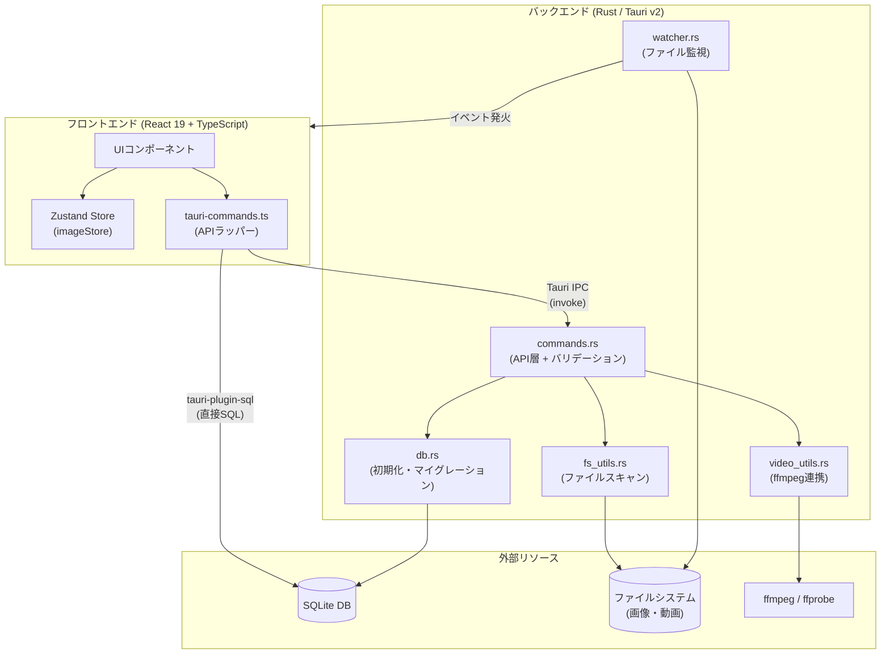
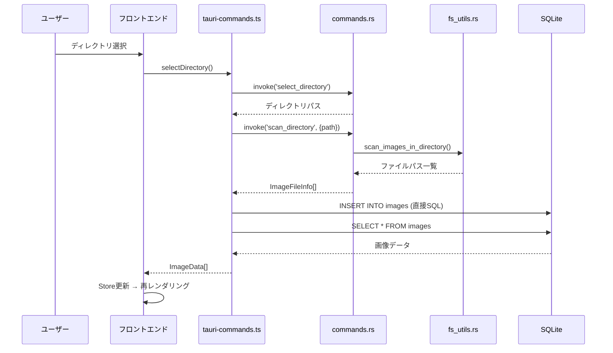
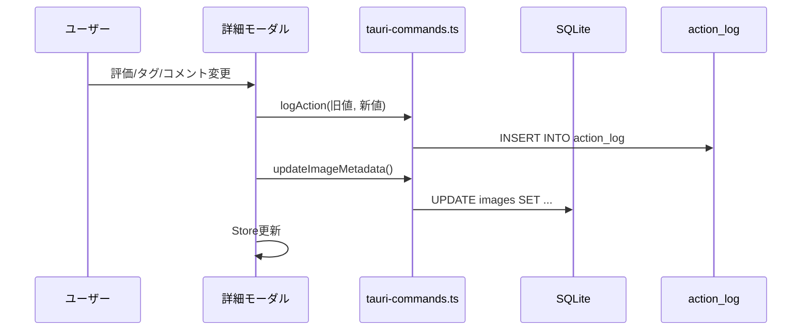
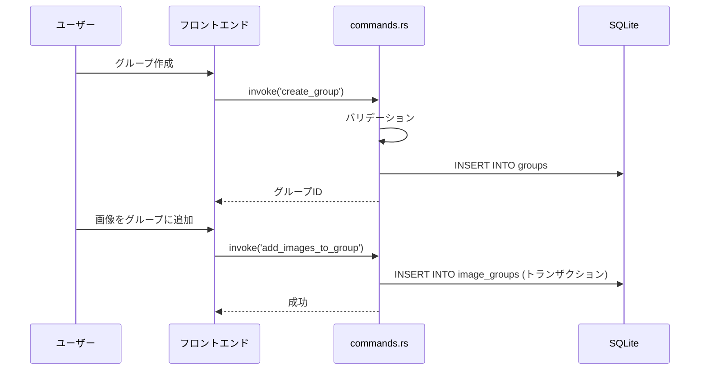

# アーキテクチャ概要

Image Gallery Manager のシステム構成と設計を説明するドキュメント。

## 技術スタック

| レイヤー | 技術 | バージョン |
|----------|------|-----------|
| フロントエンド | React + TypeScript | React 19 |
| ビルドツール | Vite | 7 |
| スタイリング | Tailwind CSS | v4 |
| 状態管理 | Zustand (persist) | — |
| ルーティング | React Router | v7 |
| アイコン | lucide-react | — |
| デスクトップ | Tauri | v2 |
| バックエンド | Rust | — |
| データベース | SQLite (tauri-plugin-sql) | — |
| 動画処理 | ffmpeg / ffprobe | — |

## システム構成図



## フロントエンド構造

### コンポーネントツリー

```
App (React Router)
├── MainGallery                    メインギャラリー画面
│   ├── Sidebar                    サイドバー（グループ一覧・ディレクトリ管理）
│   │   ├── GroupItem              グループ項目
│   │   └── directory/
│   │       ├── DirectoryManager   ディレクトリ管理パネル
│   │       └── DirectoryItem      ディレクトリ項目
│   ├── Header                     ヘッダー
│   │   ├── header/SearchBar       検索バー
│   │   ├── header/FilterPanel     フィルターパネル
│   │   ├── header/SortControls    ソートコントロール
│   │   └── header/ViewModeToggle  表示モード切替
│   ├── ImageGrid                  メディアグリッド（表示モード分岐）
│   │   ├── grid/VirtualGrid       仮想スクロールグリッド
│   │   ├── grid/VirtualList       仮想スクロールリスト
│   │   ├── grid/TimelineView      タイムラインビュー
│   │   └── grid/ListItem          リスト項目
│   ├── MediaCard                  メディアカード
│   ├── ImageDetail                詳細モーダル
│   │   ├── detail/ImageViewer     画像・動画ビューア
│   │   ├── detail/MetadataPanel   メタデータ編集パネル
│   │   ├── detail/TagAutocomplete タグオートコンプリート
│   │   └── detail/RatingStars     評価星
│   ├── SelectionBar               選択モードバー
│   ├── UndoRedoBar                Undo/Redoバー
│   ├── Toast                      トースト通知
│   ├── SlideshowControls          スライドショー
│   └── GroupModal                 グループ作成・編集モーダル
├── GroupAlbumView                 グループアルバム画面
│   ├── AlbumHeader                アルバムヘッダー
│   ├── Breadcrumb                 パンくずナビ
│   └── GroupComments              コメント機能
├── SettingsModal                  設定モーダル
│   ├── settings/ExportSection     エクスポート
│   └── settings/ImportSection     インポート
├── dnd/DndProvider                ドラッグ&ドロップ
├── dnd/DragOverlay                ドラッグオーバーレイ
├── ErrorBoundary                  エラーバウンダリ
├── EmptyState                     空状態表示
├── LoadingSpinner                 ローディング表示
└── VideoPlayer                    カスタム動画プレイヤー
```

### 状態管理

`src/store/imageStore.ts` で Zustand + persist を使用。

**主な状態:**

| カテゴリ | 状態 | 説明 |
|----------|------|------|
| データ | `images` | 画像・動画データ配列 |
| データ | `groups` | グループデータ配列 |
| データ | `directories` | ディレクトリデータ配列 |
| 表示 | `viewMode` | grid / list / timeline |
| 表示 | `gridDensity` | compact / normal / comfortable |
| フィルタ | `searchQuery` | 検索文字列 |
| フィルタ | `fileTypeFilter` | all / image / video |
| フィルタ | `minRating` | 最低評価値 |
| フィルタ | `selectedTags` | タグフィルター |
| フィルタ | `tagFilterMode` | any / all |
| ソート | `sortBy` | name / created_at / rating |
| ソート | `sortOrder` | asc / desc |
| 選択 | `selectionMode` | 選択モードON/OFF |
| 選択 | `selectedImageIds` | 選択中の画像ID |
| テーマ | `theme` | light / dark / system |

### ルーティング

```
/           → MainGallery（メインギャラリー）
/album/:id  → GroupAlbumView（グループアルバム）
```

## バックエンド構造

### モジュール構成

| ファイル | 役割 |
|----------|------|
| `main.rs` | エントリーポイント（`lib::run()` 呼び出しのみ） |
| `lib.rs` | プラグイン初期化・全コマンド登録・WatcherState管理 |
| `commands.rs` | Tauriコマンド定義（API層 + 入力バリデーション） |
| `db.rs` | DB初期化・マイグレーション定義・DBパス管理 |
| `fs_utils.rs` | ファイルスキャン・拡張子判定（walkdir使用） |
| `video_utils.rs` | ffmpeg/ffprobe連携（メタデータ抽出・サムネイル生成） |
| `watcher.rs` | ファイルウォッチャー（notify使用） |

### コマンド呼び出しの2パターン

1. **Tauri IPC（`invoke`）**: Rustコマンドを直接呼び出し。グループ管理、ディレクトリ管理、Undo/Redo、エクスポート/インポートなど
2. **tauri-plugin-sql（直接SQL）**: フロントエンドからSQLiteに直接アクセス。画像CRUDの一部（`getAllImages`, `updateImageMetadata`など）

## データフロー

### ディレクトリスキャン → 画像表示



### メタデータ編集



### グループ管理



## 対応フォーマット

| 種別 | 拡張子 |
|------|--------|
| 画像 | jpg, jpeg, png, gif, webp |
| 動画 | mp4, webm, mov |

## データベース

ER図と詳細は [er-diagram.md](./er-diagram.md) を参照。

コマンドリファレンスは [commands-reference.md](./commands-reference.md) を参照。
