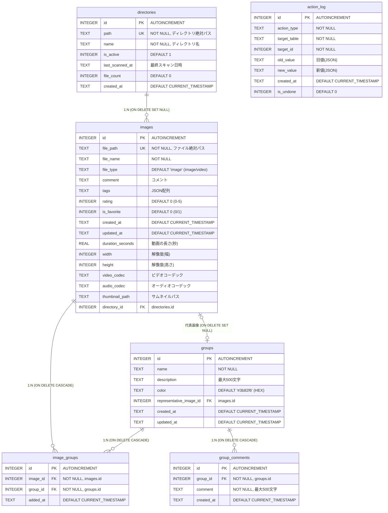

# ER図 — データベース設計

Image Gallery Manager の SQLite データベース設計。

## ER図



## リレーション詳細

| 親テーブル | 子テーブル | 関係 | 外部キー | 削除時動作 |
|-----------|-----------|------|---------|-----------|
| `directories` | `images` | 1:N | `images.directory_id` | SET NULL |
| `images` | `image_groups` | 1:N | `image_groups.image_id` | CASCADE |
| `groups` | `image_groups` | 1:N | `image_groups.group_id` | CASCADE |
| `groups` | `group_comments` | 1:N | `group_comments.group_id` | CASCADE |
| `images` | `groups` | 0..1:1 | `groups.representative_image_id` | SET NULL |

## インデックス一覧

| テーブル | インデックス名 | カラム | 追加バージョン |
|----------|---------------|--------|--------------|
| `images` | `idx_file_path` | `file_path` | v1 |
| `images` | `idx_file_name` | `file_name` | v1 |
| `images` | `idx_file_type` | `file_type` | v2 |
| `images` | `idx_is_favorite` | `is_favorite` | v3 |
| `images` | `idx_duration` | `duration_seconds` | v4 |
| `images` | `idx_resolution` | `width, height` | v4 |
| `images` | `idx_images_directory_id` | `directory_id` | v7 |
| `groups` | `idx_groups_name` | `name` | v5 |
| `groups` | `idx_groups_created_at` | `created_at` | v5 |
| `image_groups` | `idx_image_groups_image` | `image_id` | v5 |
| `image_groups` | `idx_image_groups_group` | `group_id` | v5 |
| `image_groups` | (UNIQUE) | `image_id, group_id` | v5 |
| `group_comments` | `idx_group_comments_group` | `group_id` | v6 |
| `group_comments` | `idx_group_comments_created_at` | `created_at` | v6 |
| `directories` | `idx_directories_path` | `path` | v7 |
| `directories` | `idx_directories_is_active` | `is_active` | v7 |
| `action_log` | `idx_action_log_created_at` | `created_at` | v7 |
| `action_log` | `idx_action_log_is_undone` | `is_undone` | v7 |

## マイグレーション履歴

| バージョン | 説明 | 追加Phase |
|-----------|------|----------|
| v1 | `images` テーブル作成（基本カラム + インデックス） | Phase 1 |
| v2 | `file_type` カラム追加（画像/動画の判定） | Phase 2 |
| v3 | `is_favorite` カラム追加（お気に入り機能） | Phase 2 |
| v4 | 動画メタデータカラム追加（duration, width, height, codecs, thumbnail_path） | Phase 3 |
| v5 | `groups` + `image_groups` テーブル追加（グループ管理） | Phase 4 |
| v6 | `group_comments` テーブル追加（グループコメント機能） | Phase 5 |
| v7 | `directories` + `action_log` テーブル追加、`images.directory_id` 追加 | Phase 6 |

## DBファイルの場所

```
~/Library/Application Support/com.imagegallery/gallery.db
```

旧バージョン（v0.1.0以前）: `~/.image_gallery/gallery.db`（初回起動時に自動移行）
